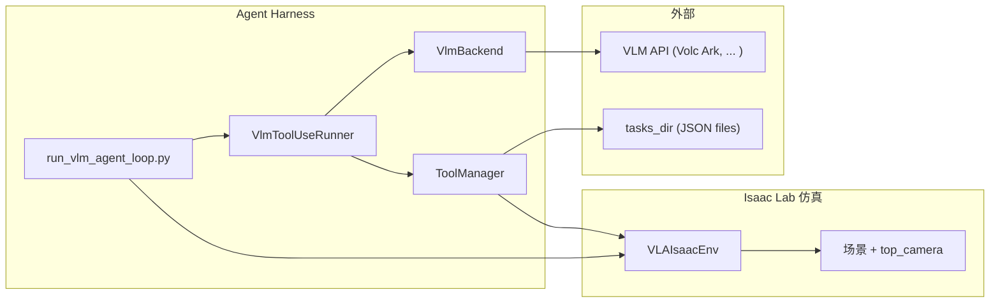

<!--
使用方式（任选其一）：
1) VSCode/Cursor 装 Marp 插件直接预览/导出
2) CLI: npx @marp-team/marp-cli@latest docs/AGENT_ARCHITECTURE_SLIDES.md --pdf
3) CLI: npx @marp-team/marp-cli@latest docs/AGENT_ARCHITECTURE_SLIDES.md --pptx

本文档内容对应：docs/AGENT_ARCHITECTURE.md
-->

# IsaacLab Logistics VLA<br/>VLM Tool-Use Agent Harness 架构（对外讲清版）

**仓库**：`isaaclab_logistics_vla`（agent 分支）  
**受众**：项目成员 / 对外同步（理解 harness 如何把 VLM 接入仿真与评测）  
**关键词**：VLM-as-Brain、Tools=Action Space、JSON 协议、任务 DAG、可复现评测

---

## 1. 我们在做什么（一句话）

在现有 IsaacLab 物流 benchmark 上，增加一层 **Agent Harness**：

- **把 VLM 作为决策大脑**
- 通过 **固定的 JSON 协议**调用 **工具（tools）**与环境交互
- 可选：让 VLM 输出一个**可持久化的任务图（DAG）**，用于计划/分解/审计

目标是形成：**可替换模型**、**可复现**、**可评测** 的 VLM agent 接入框架。

---

## 2. 这份讲解的重点（你需要记住什么）

我们主要讲清 2 个层面的东西：

- **A. 项目架构**：原项目（benchmark）有哪些模块；加入 agent 后新增哪些模块、怎么挂上去
- **B. Harness 的 5 块设计**：
  - 1) 循环（runner step loop）
  - 2) API 接入（VLM backend）
  - 3) Tools 调用（action space）
  - 4) Task（可持久化 DAG）
  - 5) 历史信息保留（messages + stats）

---

## 3. 项目架构（分层视角）

| 层次 | 职责 | 典型代码位置 |
|---|---|---|
| **仿真与任务语义** | 场景、物体、订单、成功条件 | `tasks/`、`BaseOrderCommandTerm.py`、各 `EnvCfg` |
| **环境封装** | 与 IsaacLab env 对接的评测环境 | `evaluation/evaluator/VLAIsaacEnv.py` 等 |
| **Agent Harness（新增）** | VLM 工具调用闭环、协议、统计、（可选）任务 DAG | `isaaclab_logistics_vla/agent/`、`scripts/run_vlm_agent_loop.py` |
| **基线策略（非 VLM）** | cuRobo 等 | `evaluation/models/` 等 |

---

## 3.1 项目目录结构对比（初始 vs 引入 Agent）

左侧为 **benchmark 主干**（任务/评测/资产）；右侧在相同骨架上标出 **Agent 相关新增**（`(+)` 表示本分支新增或显著扩展用途的路径）。

```
┌─ 初始：物流 VLA Benchmark 骨架 ─────────────────┐  ┌─ 加入 Agent Harness 后 ─────────────────────────┐
│ isaaclab_logistics_vla/                          │  │ isaaclab_logistics_vla/                          │
│ ├── setup.py                                     │  │ ├── setup.py                                     │
│ ├── scripts/                                     │  │ ├── scripts/                                     │
│ │   ├── evaluate_vla.py                          │  │ │   ├── evaluate_vla.py                          │
│ │   └── run_test.py                              │  │ │   ├── run_test.py                              │
│ ├── docs/                                        │  │ │   ├── run_vlm_agent_loop.py        (+)         │
│ │   └── README.md / api.md …                     │  │ │   └── run_agent_topview_tool.py    (+)         │
│ └── isaaclab_logistics_vla/   # Python 包根       │  │ ├── docs/                                        │
│     ├── tasks/            # 场景、EnvCfg、订单语义 │  │ │   ├── AGENT_ARCHITECTURE.md        (+)         │
│     ├── evaluation/       # 评测器、VLA 环境封装   │  │ │   ├── AGENT_ARCHITECTURE_SLIDES.md (+)         │
│     ├── assets/           # 机器人/环境 USD 等     │  │ │   └── …                                        │
│     └── utils/            # 注册、常量、工具函数   │  │ └── isaaclab_logistics_vla/                      │
│                                                  │  │     ├── agent/                     (+)         │
│                                                  │  │     │   # VlmBackend / Runner / Tools / Task DAG │
│                                                  │  │     ├── tasks/                                   │
│                                                  │  │     ├── evaluation/                              │
│                                                  │  │     ├── assets/                                  │
│                                                  │  │     └── utils/                                   │
│                                                  │  │                                                  │
│ （运行时本地目录，默认不入库）                      │  │ （运行时）.tasks/ / .tasks_*/        (.gitignore) │
└──────────────────────────────────────────────────┘  └──────────────────────────────────────────────────┘
```

**读图要点**：Agent 层集中在 **`isaaclab_logistics_vla/agent/`** 与 **`scripts/run_vlm_agent_loop.py`**；任务语义与仿真仍在 **`tasks/`**、**`evaluation/`** 中，二者通过 **Tool（如 `get_topview_image`）** 衔接。

---

## 4. Harness 总览：一张图讲清“VLM-as-Brain”



---

## 5. Harness 1/5：循环（Runner Step Loop）

核心：**把一轮“模型输出 → tool 执行 → 写回历史”做成稳定闭环**。

每一步 `runner.step(current_image)`：

- **输入**：当前顶视 RGB + messages 历史 + tool schema
- **backend.infer(...)**：向 VLM 发起一次推理，得到 raw 文本
- **parse JSON**：宽松解析为单对象
- 分支：
  - `{"tool_name": "...", "parameters": {...}}` → 执行 tool
  - `{"done": true, ...}` → 结束
  - （测试模式可允许其它分支，但核心协议就是这两类）

---

## 6. Harness 2/5：API 接入（VlmBackend）

目标：**把“模型调用方式”与 runner 彻底解耦**。

- runner 只认接口：`infer(image, messages, tools) -> str`
- 具体 API/协议差异藏在 backend 内部

当前已有：
- `DummyBackend`：本地假模型（不联网），用于打通链路/CI
- `VolcArkAnthropicBackend`：Anthropic 兼容协议 → 火山 Ark Coding（`ark-code-latest`）

扩展方式：
- 新增一个 backend 文件 + 在 `create_vlm_backend` 里注册名字即可

---

## 7. Harness 3/5：Tools 调用（ToolManager = Action Space）

目标：**用“工具集合”定义 agent 能做什么**，并让模型通过统一协议调用。

Tool 的三要素：
- `name`：工具名（模型要输出的 `tool_name`）
- `description`：给模型看的“说明 + 参数约定”
- `handler(**params)`：真实执行逻辑

ToolManager 做的事：
- `register()`：注册工具
- `list_tools()`：生成可用于 prompt 的 tools schema
- `execute()`：安全地执行并返回结构化结果（`success`/`error`/payload）

---

## 8. Tools 示例：`get_topview_image`

这是当前最小闭环的关键：
- 给 VLM 一个“看环境”的入口（顶视 RGB）
- 让 harness 能把“感知”形式化为 tool（而非写死在 prompt 里）

返回结果（摘要）：
- `success: bool`
- `image_rgb_uint8: ndarray(H,W,3)`（写入 messages 时会被摘要 shape/dtype）
- `height/width`

---

## 9. Harness 4/5：Task（可持久化 DAG）

目标：让 VLM 产出 **可结构化审计** 的计划，而不是只输出一段自然语言。

我们提供 4 个 task 工具：
- `task_create`：创建任务节点（可带 `blockedBy` 依赖）
- `task_update`：更新状态/依赖
- `task_get`：取单个任务
- `task_list`：按视图列出（all/ready/blocked）

任务图（DAG）语义：
- `blockedBy=[1]` 表示“本任务依赖 task_id=1 完成”
- 不是图片、不是帧号，是任务 ID 引用

---

## 10. Task 的持久化与可视化

持久化：
- `--tasks_dir/task_<id>.json`（每任务一个 JSON 文件）
- 便于跨 run 保留、回放与审计

控制台看板（人类可读）：
- `--print_task_board` 输出 READY / BLOCKED / DONE
- 只影响展示，不影响模型动作空间

实践建议：
- 评测时每个 episode 使用独立 `tasks_dir`，避免任务 ID 累积混淆

---

## 11. Harness 5/5：历史信息保留（messages + stats）

为什么要“可追溯”：
- 评测需要解释：模型为什么这么做？卡在哪里？失败原因是什么？

我们保留两类历史：

1) **对话历史 `messages`**
- system/user/assistant/tool
- tool 返回里如含大图，会写入摘要（shape/dtype），避免上下文爆炸

2) **运行统计 `RunStats` + summary JSON**
- parse_errors、invalid_calls、tool_failures、steps、done_reason 等
- `--test_plan` 下额外统计 task_create 次数、first_tool_called 等

---

## 12. 结尾：一句话总结（对外口径）

我们把 VLM 接入 IsaacLab benchmark 的方式是：

- **Runner** 做稳定循环与记录  
- **Backend** 负责对接任意模型 API  
- **Tools** 定义动作空间（观测/操作/查询）  
- **Tasks** 提供结构化计划与可持久化记忆  
- **History** 保证可复现、可审计、可评测  

在此基础上，后续只需要“加工具/加评分/加 trace”，就能逐步变成完整的 embodied benchmark harness。


